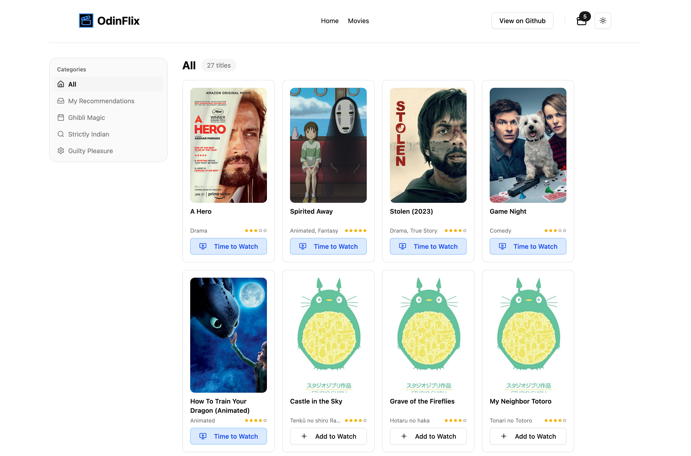

# The Odin Flix

To my fellow Odinites: This was a project where I could take one of my favourite UI libraries '[shadcn/ui](https://ui.shadcn.com/)' and make a frontend project.

While I started making a shopping cart as suggested in [The Odin Project course](https://www.theodinproject.com/lessons/node-path-react-new-shopping-cart), I decided to pivot and build a similar, function-wise application: **The Odin Flix**. This is an app that works like Letterboxd or IMDB, but with a cleaner, more minimal UI. 

Finally, an application where I could showcase some of my UI design skills, which is what I currently do for a living!

## Live Demo

[Odin Flix Live](https://your-app-link.com)

## Tech Stack

- React (Vite)
- TypeScript
- [shadcn/ui](https://ui.shadcn.com/) (Radix + Tailwind CSS)
- React Router
- LocalStorage for persistence
- Custom Context API for watch list management

## Data Source

- Some movie data is manually curated (for flexibility and design).
- For the "Ghibli Magic" section, I’ve used the [Studio Ghibli API](https://ghibliapi.vercel.app/) so I could learn to integrate free APIs along with manual data.

